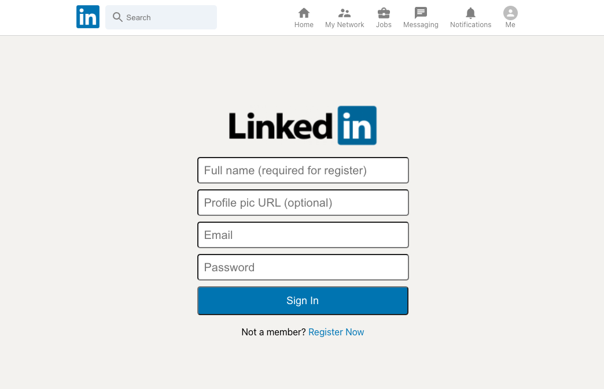
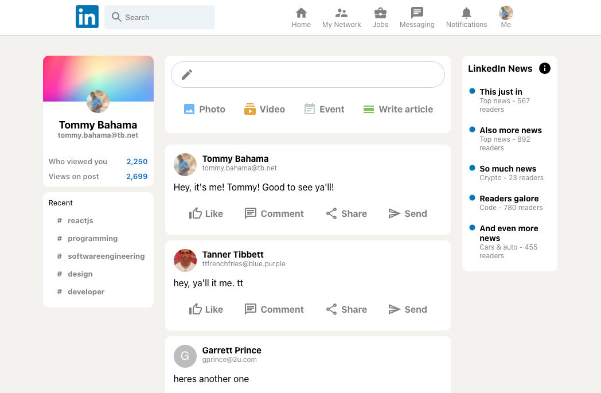

# LinkedIn Clone
> Built with React, Redux, and Firebase. Based on Sonny Songha's LinkedIn Clone tutorial.
> Live demo [_here_](https://linkedin-clone-nine-nu.vercel.app).

## Table of Contents
* [General Info](#general-information)
* [Technologies Used](#technologies-used)
* [Features](#features)
* [Screenshots](#screenshots)
* [Setup](#setup)
* [Project Status](#project-status)
* [Room for Improvement](#room-for-improvement)
* [Acknowledgements](#acknowledgements)

## General Information
- LinkedIn Clone using React, Redux and Firebase
- Responsive media query sizing (with limitations)
- Implementation of Material UI components in React
- User storage and auth using Firestore and Firebase
- I completed this project as my first introduction into Redux and Firebase
- Great practice with React and components

## Technologies Used
- React v17.0.2
- Redux v7.2.4 
- Material UI v4.12.1
- Firebase v8.7.0

## Features
- Account creation and state management using Redux
- Posts created are sorted by post date using Firebase timestamp
- Responsive sizing for smaller screens (800px)
- Photo URL is maintained in feed as well as initial login

## Screenshots

## Setup
Install the dependencies used in this project on NPM using the following commands:

React and Redux: 
`npm install create-react-app my-app --template redux`

Firebase:
`npm install firebase`

Material UI:
`npm install @mui/material @emotion/react @emotion/styled @mui/icons-material`

## Project Status
Project is: _complete_ 

## Room for Improvement
- Responsive sizing is limited to a single 800px media query as a last thought to the clone, needs to be intergrated as I'm styling each section. Will make production a lot easier in the end.
- A refresh once logged in will erase profil photo from screen. Need to figure out why and spend more time with Redux in the future to troubleshoot those types of issues.
- When undergoing a project like this, I need to check the date of when the tutorial was made. This was a really productive (and frustrating) lesson in making sure my dependencies were the correct ones use in a project.

## Acknowledgements
- This project was based on [this tutorial](https://www.youtube.com/watch?v=tbvguOj8C-o&t=40646s) by Sonny Sangha.
- Also shoutout to user LloydJanseVanRensburg on github as a reference point to enure my dependencies were set up correctly
